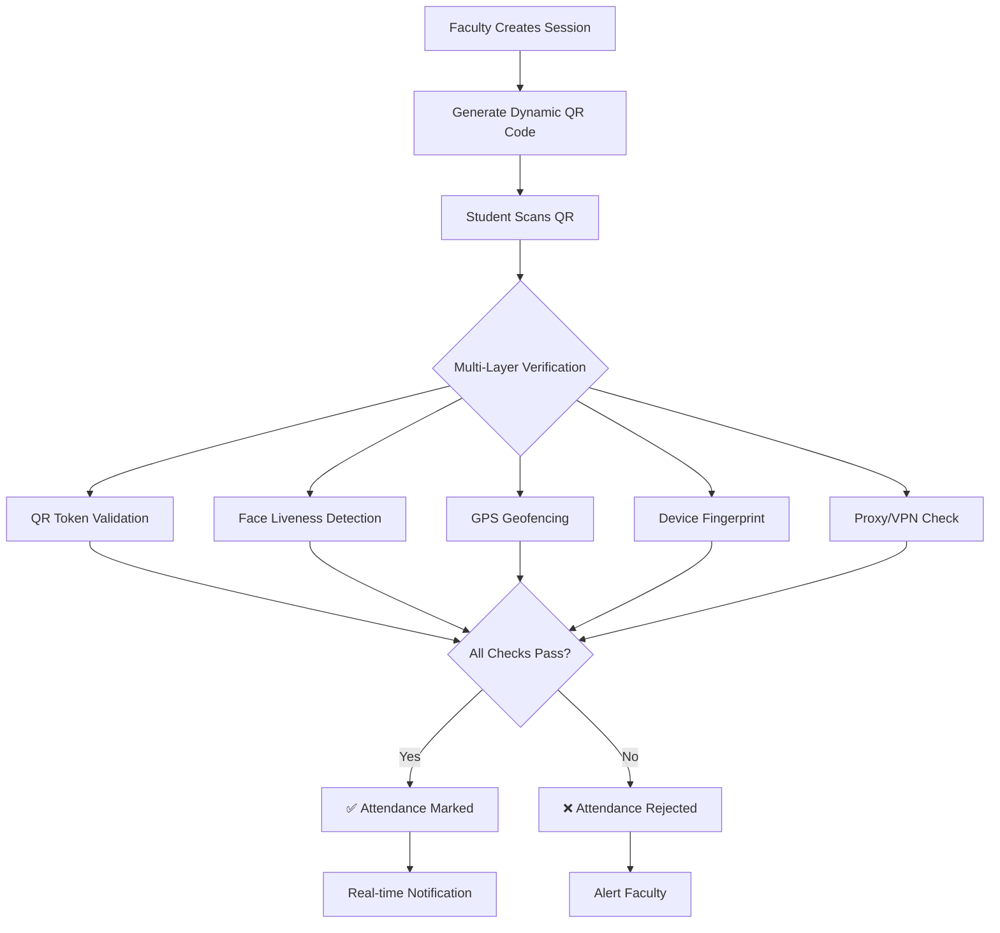

<div align="center">

# 🎓 ProxyMukt - Smart Hybrid Attendance System

### *Revolutionizing Attendance Management with AI-Powered Security*

[](https://github.com/SameerMahato/ProxyMukt---Automated-Student-Attendance-System)
[](LICENSE)
[](https://github.com/SameerMahato/ProxyMukt---Automated-Student-Attendance-System)
[](https://nodejs.org/)
[](https://www.mongodb.com/)
[](https://reactjs.org/)

**[🚀 Features](#-key-features) • [📸 Screenshots](#-screenshots) • [💻 Tech Stack](#-tech-stack) • [⚡ Quick Start](#-quick-start) • [📖 Documentation](#-documentation)**

---

</div>

## 🌟 Overview

**ProxyMukt** is a next-generation, enterprise-grade attendance management system designed to **eliminate proxy attendance** through cutting-edge AI and multi-layer security. Built for educational institutions, it combines **rotating QR codes**, **face liveness detection**, **GPS geofencing**, and **device fingerprinting** to ensure 100% authentic attendance.

### 🎯 Why ProxyMukt?

| Traditional Systems | ProxyMukt |
|:---:|:---:|
| ❌ Screenshot sharing | ✅ Dynamic QR (20s rotation) |
| ❌ Location spoofing | ✅ GPS geofencing + accuracy validation |
| ❌ Proxy marking | ✅ Face liveness + multi-face detection |
| ❌ Device sharing | ✅ Device fingerprinting |
| ❌ Manual tracking | ✅ Real-time analytics |

---

## ✨ Key Features

<table>
<tr>
<td width="50%">

### 🔐 **Security & Anti-Fraud**
- 🔄 **Dynamic QR Codes** - HMAC-SHA256 signed, 20-second rotation
- 👤 **Face Liveness Detection** - TensorFlow.js powered, multi-face rejection
- 📍 **GPS Geofencing** - Location-based validation with accuracy checks
- 🖥️ **Device Fingerprinting** - Unique device tracking & multi-device detection
- 🛡️ **Proxy/VPN Detection** - Advanced IP reputation analysis
- 🔒 **JWT Authentication** - Secure token-based auth with refresh tokens

</td>
<td width="50%">

### 👥 **Role-Based Dashboards**
- 👑 **Admin** - System analytics, user management, audit logs
- 👨‍🏫 **Faculty** - Class management, session control, real-time monitoring
- 👨‍🎓 **Student** - QR scanning, attendance history, performance tracking
- 📊 **Real-Time Analytics** - Live dashboards with charts & insights
- 🎯 **Gamification** - Streaks, badges, leaderboards
- 📱 **Fully Responsive** - Mobile, tablet, desktop optimized

</td>
</tr>
<tr>
<td width="50%">

### ⚡ **Real-Time Features**
- 🔴 **Live Session Monitoring** - WebSocket-powered updates
- 🔔 **Instant Notifications** - Real-time alerts & badges
- 📈 **Auto-Refreshing Dashboards** - Live data every 30 seconds
- 💬 **Announcements** - Campus-wide broadcast system
- 🎥 **Online Sessions** - Zoom/Meet/Teams integration
- ⏸️ **Session Controls** - Pause/resume functionality

</td>
<td width="50%">

### 📊 **Analytics & Reporting**
- 📉 **Attendance Trends** - Visual charts (Line, Bar, Pie, Area)
- 📋 **CSV/PDF Exports** - Comprehensive report generation
- 🎯 **Performance Metrics** - Student & class-wise analytics
- 🚨 **Alert System** - At-risk student identification
- 📅 **Timetable Management** - Automated scheduling
- 🏆 **Leaderboards** - Competitive ranking system

</td>
</tr>
</table>

---

## 📸 Screenshots

<div align="center">

### 🎨 **Modern, Clean UI Design**

<table>
<tr>
<td width="33%">

<p align="center"><b>Admin Analytics Dashboard</b><br/>System-wide insights with 4 unique tabs</p>
</td>
<td width="33%">

<p align="center"><b>Faculty Control Room</b><br/>Real-time session monitoring</p>
</td>
<td width="33%">

<p align="center"><b>Student Dashboard</b><br/>Attendance tracking & performance</p>
</td>
</tr>
</table>

### 🌈 **Key Highlights**
- ✨ **Glass Morphism** design with smooth animations
- 🌙 **Dark Theme** optimized for long sessions
- 📱 **Mobile Responsive** with hamburger menu
- 🎯 **Touch-Friendly** buttons (44px minimum)
- 🔔 **Live Badges** for notifications & alerts

</div>

---

## 🛠️ Tech Stack

<div align="center">

### **Frontend**


### **Backend**


### **Security & AI**


</div>

### 📦 **Complete Stack**

<table>
<tr>
<td width="50%">

**Frontend Technologies**
- ⚛️ React 18 with Hooks
- ⚡ Vite for blazing-fast builds
- 🎨 Tailwind CSS (Mobile-first)
- 🎬 Framer Motion animations
- 🔌 Socket.IO Client
- 🗂️ Zustand state management
- 📊 Recharts data visualization
- 🎯 React Router v6
- 📡 Axios for API calls

</td>
<td width="50%">

**Backend Technologies**
- 🟢 Node.js v18+
- 🚂 Express.js framework
- 🍃 MongoDB with Mongoose
- 🔌 Socket.IO server
- 🔐 JWT authentication
- 🔒 Bcrypt password hashing
- 🛡️ Helmet security headers
- ⏱️ Express Rate Limit
- 📧 Nodemailer for emails

</td>
</tr>
</table>

---

## ⚡ Quick Start

### 📋 **Prerequisites**

```bash
Node.js >= 18.0.0
MongoDB >= 6.0
Git
```

### 🚀 **Installation (5 Minutes)**

```bash
# 1️⃣ Clone the repository
git clone https://github.com/SameerMahato/ProxyMukt---Automated-Student-Attendance-System.git
cd ProxyMukt---Automated-Student-Attendance-System

# 2️⃣ Backend Setup
cd server
npm install
cp .env.example .env
# Edit .env with your MongoDB URI and secrets
npm run seed    # Seed database with test data
npm run dev     # Start backend server

# 3️⃣ Frontend Setup (New Terminal)
cd ../client
npm install
cp .env.example .env
# Edit .env with backend API URL
npm run dev     # Start frontend

# 4️⃣ Access Application
# Frontend: http://localhost:5173
# Backend:  http://localhost:5000
```

### 🔑 **Test Credentials**

| Role | Email | Password | Access Level |
|:----:|:------|:---------|:-------------|
| 👑 **Admin** | admin@proxymukt.com | Admin@123 | Full system access |
| 👨‍🏫 **Faculty** | faculty1@gmail.com | faculty1 | Class & session management |
| 👨‍🎓 **Student** | student1@gmail.com | student1 | Attendance & performance |

---

## 🔧 Configuration

### **Server Environment Variables** (`server/.env`)

```env
# Database
MONGODB_URI=mongodb://localhost:27017/proxymukt

# JWT Secrets (Change in production!)
JWT_ACCESS_SECRET=your-super-secret-access-key-change-this
JWT_REFRESH_SECRET=your-super-secret-refresh-key-change-this

# QR Code Secret
QR_SECRET=your-qr-secret-key-change-this

# Client URL
CLIENT_URL=http://localhost:5173

# Server Port
PORT=5000

# Email Configuration (Optional)
EMAIL_HOST=smtp.gmail.com
EMAIL_PORT=587
EMAIL_USER=your-email@gmail.com
EMAIL_PASS=your-app-password
```

### **Client Environment Variables** (`client/.env`)

```env
# Backend API URL
VITE_API_URL=http://localhost:5000/api

# Optional: Google Maps API (for location features)
VITE_GOOGLE_MAPS_API_KEY=your-google-maps-api-key
```

---

## 🎯 How It Works

### **📊 System Architecture**



### **🔄 Attendance Flow**

<table>
<tr>
<td width="33%">

**1️⃣ Faculty Side**
- Create class
- Enroll students
- Start session
- Configure verification
- Monitor real-time
- Review analytics

</td>
<td width="33%">

**2️⃣ Student Side**
- Scan rotating QR
- Face verification
- Location check
- Device validation
- Instant confirmation
- View attendance

</td>
<td width="33%">

**3️⃣ Security Checks**
- QR signature verify
- Face liveness (3 frames)
- Multi-face rejection
- GPS accuracy check
- Device fingerprint
- IP reputation

</td>
</tr>
</table>

---

## 📁 Project Structure

```
ProxyMukt/
│
├── 📂 client/                      # React Frontend
│   ├── 📂 src/
│   │   ├── 📂 components/         # Reusable UI components
│   │   │   ├── Sidebar.jsx        # Responsive sidebar with hamburger
│   │   │   ├── Navbar.jsx         # Top navigation bar
│   │   │   ├── StatsCard.jsx      # Dashboard stat cards
│   │   │   ├── FaceVerification.jsx  # Face detection component
│   │   │   └── ...
│   │   ├── 📂 pages/              # Page components
│   │   │   ├── StudentDashboard.jsx
│   │   │   ├── FacultyDashboard.jsx
│   │   │   ├── AdminDashboard.jsx
│   │   │   ├── ScanQR.jsx
│   │   │   └── ...
│   │   ├── 📂 store/              # Zustand state management
│   │   │   ├── authStore.js       # Authentication state
│   │   │   └── sessionStore.js    # Session state
│   │   ├── 📂 services/           # API services
│   │   │   └── api.js             # API endpoints
│   │   ├── 📂 utils/              # Utility functions
│   │   │   ├── axiosInstance.js   # Axios configuration
│   │   │   ├── deviceFingerprint.js  # Device tracking
│   │   │   └── voiceAnnouncements.js
│   │   └── App.jsx                # Main app component
│   ├── package.json
│   └── vite.config.js
│
├── 📂 server/                      # Node.js Backend
│   ├── 📂 src/
│   │   ├── 📂 controllers/        # Business logic
│   │   │   ├── authController.js
│   │   │   ├── sessionController.js
│   │   │   ├── attendanceController.js
│   │   │   └── ...
│   │   ├── 📂 models/             # Mongoose schemas
│   │   │   ├── User.js
│   │   │   ├── Class.js
│   │   │   ├── Session.js
│   │   │   ├── Attendance.js
│   │   │   └── ...
│   │   ├── 📂 routes/             # API routes
│   │   │   ├── authRoutes.js
│   │   │   ├── sessionRoutes.js
│   │   │   └── ...
│   │   ├── 📂 middleware/         # Custom middleware
│   │   │   ├── auth.js            # JWT verification
│   │   │   ├── role.js            # Role-based access
│   │   │   ├── auditLogger.js     # Audit logging
│   │   │   └── errorHandler.js
│   │   ├── 📂 utils/              # Utility functions
│   │   │   ├── qr.js              # QR generation
│   │   │   └── deviceFingerprint.js
│   │   ├── 📂 config/             # Configuration
│   │   │   └── db.js              # MongoDB connection
│   │   └── server.js              # Entry point
│   ├── seed.js                    # Database seeder
│   └── package.json
│
├── 📂 images/                      # Screenshots
├── 📄 README.md                    # This file
├── 📄 LICENSE                      # MIT License
├── 📄 INSTALLATION_GUIDE.md        # Detailed setup guide
├── 📄 DEPLOYMENT_GUIDE.md          # Deployment instructions
├── 📄 APPLICATION_STATUS.md        # Feature status
└── 📄 render.yaml                  # Render.com config
```

---

## 📖 Documentation

### 📚 **Available Guides**

| Document | Description |
|:---------|:------------|
| [📘 Installation Guide](INSTALLATION_GUIDE.md) | Step-by-step setup instructions |
| [🚀 Deployment Guide](DEPLOYMENT_GUIDE.md) | Deploy to Render, Vercel, AWS |
| [📊 Application Status](APPLICATION_STATUS.md) | Complete feature list & status |
| [🔧 Troubleshooting](TROUBLESHOOTING_CLASS_CREATION.md) | Common issues & solutions |
| [📱 Mobile Responsive](MOBILE_RESPONSIVE_IMPLEMENTATION.md) | Responsive design guide |
| [🎯 Real-World Usage](REAL_WORLD_USAGE_GUIDE.md) | Best practices & workflows |

### 🔌 **API Endpoints**

<details>
<summary><b>Authentication APIs</b></summary>

```javascript
POST   /api/auth/register          // Register new user
POST   /api/auth/login             // User login
POST   /api/auth/refresh           // Refresh access token
POST   /api/auth/logout            // User logout
GET    /api/auth/me                // Get current user
PUT    /api/auth/change-password   // Change password
```
</details>

<details>
<summary><b>Session APIs</b></summary>

```javascript
POST   /api/sessions               // Create new session
GET    /api/sessions               // Get all sessions
GET    /api/sessions/:id           // Get session by ID
GET    /api/sessions/:id/qr        // Get QR token
PATCH  /api/sessions/:id/status    // Update session status
PATCH  /api/sessions/:id/verification  // Update verification settings
DELETE /api/sessions/:id           // Delete session
```
</details>

<details>
<summary><b>Attendance APIs</b></summary>

```javascript
POST   /api/attendance/mark        // Mark attendance
GET    /api/attendance/session/:id // Get session attendance
GET    /api/attendance/student/:id // Get student attendance
GET    /api/attendance/my-attendance  // Get my attendance
GET    /api/attendance/analytics   // Get attendance analytics
```
</details>

<details>
<summary><b>Class APIs</b></summary>

```javascript
POST   /api/classes                // Create class
GET    /api/classes                // Get all classes
GET    /api/classes/:id            // Get class by ID
PUT    /api/classes/:id            // Update class
DELETE /api/classes/:id            // Delete class
POST   /api/classes/join           // Join class (student)
GET    /api/classes/available/all  // Get available classes
```
</details>

---

## 🚀 Deployment

### **Deploy to Render.com** (Recommended)

1. **Push to GitHub**
   ```bash
   git push origin master
   ```

2. **Create Render Account**
   - Go to [render.com](https://render.com)
   - Sign up with GitHub

3. **Deploy Backend**
   - New → Web Service
   - Connect repository
   - Build Command: `cd server && npm install`
   - Start Command: `cd server && npm start`
   - Add environment variables

4. **Deploy Frontend**
   - New → Static Site
   - Connect repository
   - Build Command: `cd client && npm install && npm run build`
   - Publish Directory: `client/dist`
   - Add environment variables

5. **Configure MongoDB Atlas**
   - Create cluster at [mongodb.com/cloud/atlas](https://www.mongodb.com/cloud/atlas)
   - Get connection string
   - Add to Render environment variables

### **Deploy to Vercel** (Frontend Only)

```bash
cd client
npm install -g vercel
vercel --prod
```

---

## 🎓 Use Cases

### **Perfect For:**

- 🏫 **Universities & Colleges** - Large-scale attendance management
- 🏢 **Corporate Training** - Employee attendance tracking
- 📚 **Coaching Institutes** - Student attendance & performance
- 🎯 **Workshops & Events** - Participant tracking
- 💼 **Hybrid Workplaces** - Office & remote attendance

### **Key Benefits:**

✅ **99.9% Fraud Prevention** - Multi-layer security  
✅ **Real-Time Insights** - Live dashboards & analytics  
✅ **Mobile-First Design** - Works on any device  
✅ **Easy Integration** - RESTful APIs  
✅ **Scalable Architecture** - Handles 10,000+ users  
✅ **Cost-Effective** - Open-source & self-hosted  

---

## 🤝 Contributing

We welcome contributions! Here's how you can help:

### **Ways to Contribute**

1. 🐛 **Report Bugs** - [Open an issue](https://github.com/SameerMahato/ProxyMukt---Automated-Student-Attendance-System/issues)
2. 💡 **Suggest Features** - Share your ideas
3. 📝 **Improve Documentation** - Fix typos, add examples
4. 🔧 **Submit Pull Requests** - Add features or fix bugs

### **Development Workflow**

```bash
# 1. Fork the repository
# 2. Clone your fork
git clone https://github.com/YOUR_USERNAME/ProxyMukt---Automated-Student-Attendance-System.git

# 3. Create a feature branch
git checkout -b feature/AmazingFeature

# 4. Make your changes
# 5. Commit with descriptive message
git commit -m 'feat: Add amazing feature'

# 6. Push to your fork
git push origin feature/AmazingFeature

# 7. Open a Pull Request
```

### **Code Style**

- ✅ Use ESLint for JavaScript
- ✅ Follow React best practices
- ✅ Write meaningful commit messages
- ✅ Add comments for complex logic
- ✅ Test before submitting PR

---

## 📄 License

This project is licensed under the **MIT License** - see the [LICENSE](LICENSE) file for details.

```
MIT License

Copyright (c) 2026 Sameer Mahato

Permission is hereby granted, free of charge, to any person obtaining a copy
of this software and associated documentation files (the "Software"), to deal
in the Software without restriction, including without limitation the rights
to use, copy, modify, merge, publish, distribute, sublicense, and/or sell
copies of the Software, and to permit persons to whom the Software is
furnished to do so, subject to the following conditions:

The above copyright notice and this permission notice shall be included in all
copies or substantial portions of the Software.

THE SOFTWARE IS PROVIDED "AS IS", WITHOUT WARRANTY OF ANY KIND, EXPRESS OR
IMPLIED, INCLUDING BUT NOT LIMITED TO THE WARRANTIES OF MERCHANTABILITY,
FITNESS FOR A PARTICULAR PURPOSE AND NONINFRINGEMENT.
```

---

## 👨‍💻 Author

<div align="center">

### **Sameer Mahato**

*Full Stack Developer | MERN Stack Specialist | AI Enthusiast*

[](https://github.com/SameerMahato)
[](mailto:sameermahato793@gmail.com)
[](https://linkedin.com/in/sameermahato)

</div>

---

## 📞 Support & Contact

<div align="center">

### **Need Help?**

| Channel | Link |
|:--------|:-----|
| 📧 **Email** | [sameermahato793@gmail.com](mailto:sameermahato793@gmail.com) |
| 🐛 **Bug Reports** | [GitHub Issues](https://github.com/SameerMahato/ProxyMukt---Automated-Student-Attendance-System/issues) |
| 💬 **Discussions** | [GitHub Discussions](https://github.com/SameerMahato/ProxyMukt---Automated-Student-Attendance-System/discussions) |
| 📖 **Documentation** | [Wiki](https://github.com/SameerMahato/ProxyMukt---Automated-Student-Attendance-System/wiki) |

**Response Time:** Usually within 24-48 hours

</div>

---

## 🙏 Acknowledgments

Special thanks to:

- 🧠 **TensorFlow.js** - Face detection models
- 🔌 **Socket.IO** - Real-time communication
- 🍃 **MongoDB** - Database solutions
- ⚛️ **React Team** - Amazing framework
- ⚡ **Vite** - Lightning-fast build tool
- 🎨 **Tailwind CSS** - Beautiful styling
- 🌐 **Open Source Community** - Inspiration & support

---

## 📊 Project Stats

<div align="center">


</div>

---

<div align="center">

### ⭐ **Star this repository if you find it helpful!**

**Made with ❤️ for educational institutions worldwide**

### 🚀 **Ready to eliminate proxy attendance?**

[**Get Started Now →**](#-quick-start)

---

[⬆ Back to Top](#-proxymukt---smart-hybrid-attendance-system)

</div>
